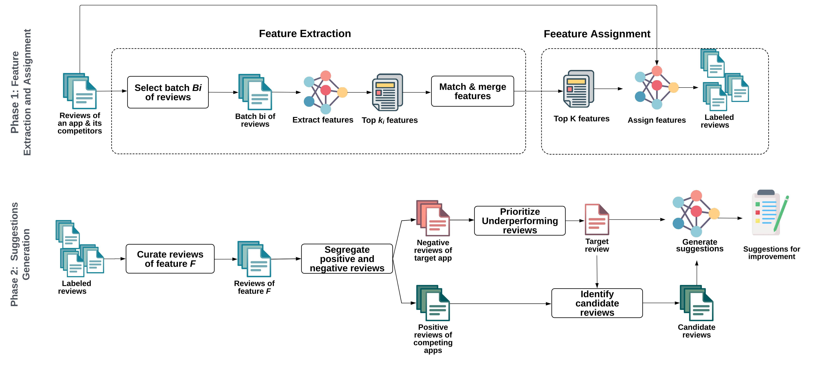

# Replication Package for LLM-Cure Study
This repository contains the replication package for the study on feature assignment, feature extraction, and improvement suggestions for mobile applications using LLM-Cure. Below are the details of the repository contents and instructions for usage.

## Abstract
LLM-Cure, a novel approach powered by large lan guage models (LLMs) to automatically generate suggestions for
mobile app feature improvements by leveraging insights from the competitive landscape. LLM-Cure operates in two phases. First, it
identifies and categorizes high-level features within reviews usingits LLM capabilities. Secondly, when provided with a complaint in
a user review, LLM-Cure curates highly rated features in competing apps related to the complaint and proposes potential improvements tailored to the target application.

## Repository Structure

### 1. Dataset Directory
The `dataset` directory contains the main data used in this study, including reviews and release notes of 70 mobile applications across 7 categories.

#### Dataset Description

- **Reviews Data**: Each file named `category_reviews.csv` contains the reviews for a specific category of mobile apps. 

- **Release Notes Data**: Files contain app release information.

### 2. Prompts Directory
The `prompts` directory contains the list of prompts used in the LLM-Cure process for feature assignment, feature extraction, and improvement suggestions steps.

### 3. Results Directory
The `results` directory contains the results of RQ1 and RQ2:

- **RQ1 Results**:
  - Extracted top features for each mobile app category.
  - Ground truth reviews with the automatically assigned feature label by the LLM.

- **RQ2 Use Case Results**:
  - Results for two use cases: Weather clock & widget app - suggestions related to "ease of use" and "radar" features.

## Usage
To replicate the results presented in the study, you will need to follow these steps:

### Prerequisites

- **Mistral AI Key**: To run the model, you need to generate a Mistral AI key.
- **Python Environment**: Follow the instructions for the Python code found on [Hugging Face Mistral](https://huggingface.co/mistralai/Mixtral-8x7B-Instruct-v0.1) for generating the key.

### Running the Model

1. **Generate Mistral AI Key**: Obtain your key from the Mistral AI service.
2. **Set Up Environment**:
   - Install necessary dependencies as per the instructions on the [Hugging Face Mistral](https://huggingface.co/mistralai/Mixtral-8x7B-Instruct-v0.1) page.
   - Follow the Hugging Face instructions to set up your environment and authenticate with your Mistral AI key
3. **Use Prompts**: Utilize the prompts found in the `prompts` directory to run the model for different tasks.
